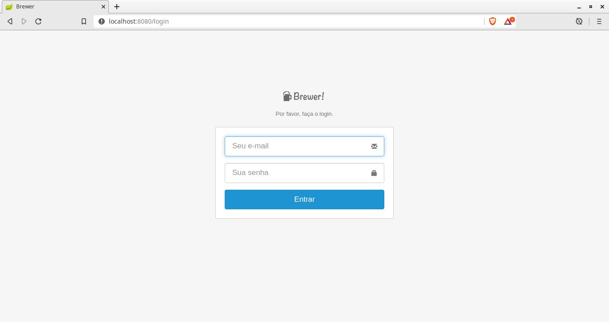

# Brewer
Projeto desenvolvido durante o curso spring framerwork experts algaworks.
* Ementa do curso: [Ementa do curso](Ementa-Spring-Framework-Expert.pdf)

Principais funcionalidades: 
- Cadastro de cliente.
- Cadastro de cerveja.
- Venda de cerveja com itens.
- Upload de foto assincrono, local e s3.
- Pesquisa, redimensionamento da foto, paginação e ordenação.
- Pesquisa com filtros avançados e multisseleção de linhas. 
- Páginas de erros customizadas.
- Página mestre-detalhe, escopo de sessão e testes unitários.
- Cache na busca de cidades por estado.
- Controle de log.
- Controle de permissões e de login com spring security.
- Pesquisa com filtros avançados e multisseleção de linhas. 
- Envio de e-mails e chamadas assíncronas.
- Dashboard - consultas avançadas e gráficos.
- Box de vendas no ano, no mês e ticket médio.
- Gráfico - Vendas por mês. 
- Consultas em arquivos externos. 
- Relatórios de vendas emitidas com JasperReports.

# Demonstração

# Modelo ER

# Diagramas de classe

